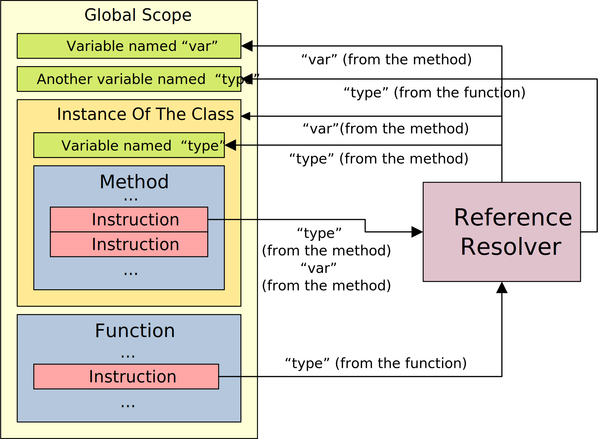

.. SPDX-License-Identifier: GFDL-1.3-only OR CC-BY-SA-4.0

Reference
=========

Slake Runtime uses the mechanism called Referencing to locate variables,
functions and variables, etc.

Resolving
---------

The reference resolver has two mode to resolve references just like the file
system: relative and absolute.

In relative mode, the resolver will try to resolve the reference within current
scope, and the absolute mode is similar to the relative mode but resolves
within the global scope.

The resolver will try to resolve the reference in relative mode by default, in
absolute mode if relative resolution was failed.

For example, an instruction in a method of a class requires a variable named
`type`, and the instance of the class and the global scope both have a variable
named the same, then the resolver will fetch the variable of the instance of
the class because it will always resolve references within current scope.
