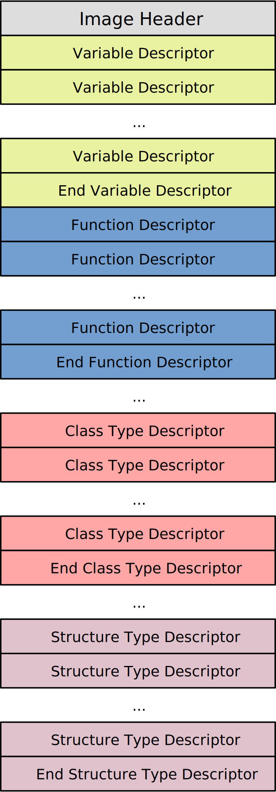

File Structure
==============

**Image Header** (IMH): Stores metadata of the module.

**Variable Descriptor** (VAD): Stores metadata of a variable, such as name and
initial value.

**Function Descriptor** (FND): Stores metadata of a function, may be followed
by instructions if it was implemented.

**Class Type Descriptor** (CTD): Stores metadata of a class type, such as name,
default generic parameters and implemented traits (also used by trait types).

**Structure Type Descriptor** (STD): Stores metadata of a structure type.

Note that the end descriptors always have zero length name.
