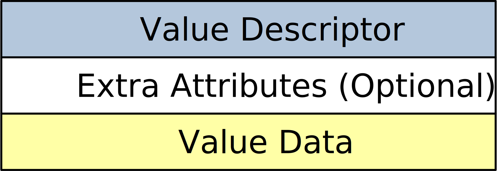

.. SPDX-License-Identifier: GFDL-1.3-only OR CC-BY-SA-4.0

Value
=====

Value in the SLX format stores a literal or a reference.

Header
------

+------------------+-------------+
| Offset (in bits) | Description |
+==================+=============+
| 0-4              | Value type. |
+------------------+-------------+
| 5-7              | Flags       |
+------------------+-------------+
